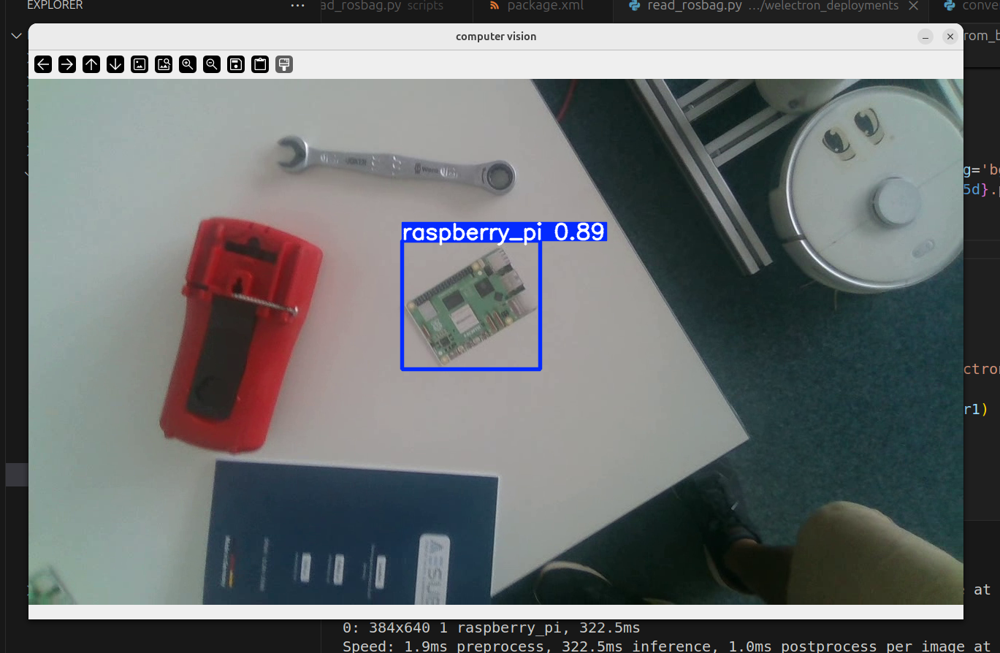

# ROSComputerVision
## Intel Realsense ROS2
The scripts in this repository were used to extract information stored in the ROSbag recordings from the RealSense camera. 
Below, we will briefly explain how to install the ROS environment for the RealSense camera and the commands for recording ROSbags used in the scripts in this repository.
For this explanation, ROS2 should have already been installed. See ROS documentation https://docs.ros.org/en/jazzy/Installation/Ubuntu-Install-Debs.html
1. Install the latest Intel Realsense SDK 2.0 using the following commands:
   ```
   sudo apt install ros-jazzy-librealsense2*

   ```
2. Then, create the ROS2 workspace using the following commands:
  ```
   mkdir -p ~/ros2_ws/src
   cd ~/ros2_ws/src/
   git clone https://github.com/IntelRealSense/realsense-ros.git -b ros2-master
   cd ~/ros2_ws
   sudo apt-get install python3-rosdep -y
   sudo rosdep init
   rosdep update
   rosdep install -i --from-path src --rosdistro $ROS_DISTRO --skip-keys=librealsense2 -y
   ```
3. Then, build the new ROS package and create a source using the following commands:
   ```
   colcon build
   ROS_DISTRO=<YOUR_SYSTEM_ROS_DISTRO> # set your ROS_DISTRO: iron, humble, foxy
   source /opt/ros/$ROS_DISTRO/setup.bash
   cd ~/ros2_ws
   . install/local_setup.bash
   ```

4. To turn on the camera using ROS, use any of the following commands in a terminal:
   ```
   ros2 run realsense2_camera realsense2_camera_node
   ros2 launch realsense2_camera rs_launch.py
   ```
   
5. To record the image data sent by the camera:
   ```
   ros2 bag record <topic_name>
   ros2 bag record <topic_name1> <topic_name2>
   ```

6. To play recorded rosbag:
   ```
   ros2 bag play <name_rosbag>
   ```

The read_rosbag.py script reads the data sent by the rosbag and saves it as frames in a specific folder.  
The split_frames.py script randomly extracts a percentage of the frames from a folder and copies them to another folder.  
The .... script trains the computer vision model using a pre-trained YOLOv11 model.  
The convert_rosbag_to_mp4.py script converts the rosbag file into a file that the machine can read without running ROS. In this case, an mp4 file.  
The vision_stream.py script loads the trained model and tests it using a video or streaming it with a camera.  

Below are the results of the trained computer vision model  



